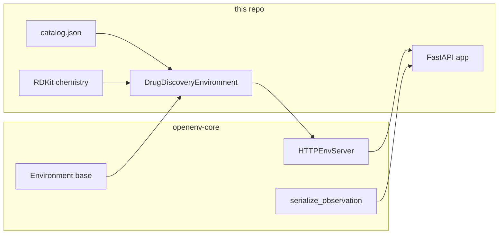

# OpenEnv integration (drug discovery)

This repository implements a **custom environment** that plugs into the **OpenEnv** stack: the `openenv-core` Python package provides base types and an HTTP server helper; this project supplies the domain logic (RDKit, tasks, grading) and the FastAPI app that hosts the env.

## Manifest (`openenv.yaml`)

The Space/runtime manifest declares:

| Field | Value | Role |
|--------|--------|------|
| `spec_version` | `1` | OpenEnv spec version |
| `name` | `drug_discovery_env` | Environment identifier |
| `type` | `space` | Hugging Face Space–style deployment |
| `runtime` | `fastapi` | ASGI server pattern |
| `app` | `server.app:app` | Import path for the FastAPI `app` object |
| `port` | `7860` | Default listen port (Spaces often set `PORT` as well) |

Tools that validate or build the submission read this file to discover **how to start the server** and **what the environment is called**.

## Dependency (`pyproject.toml`)

- **`openenv-core[core]>=0.2.2`** — base `Environment` class, env server utilities, shared types (`Action`, `Observation`, `State`), serialization helpers, and `HTTPEnvServer`.

RDKit, FastAPI, Uvicorn, Pydantic, etc. are additional runtime dependencies for chemistry and HTTP.

## Environment class

**Implementation:** `drug_discovery_env/server/drug_discovery_environment.py`

- **`DrugDiscoveryEnvironment`** subclasses:

  `openenv.core.env_server.Environment[DrugDiscoveryAction, DrugDiscoveryObservation, DrugDiscoveryState]`

- It implements the OpenEnv-style lifecycle and hooks your domain:

  - Loads tasks from `drug_discovery_env/tasks/catalog.json` (via `load_task_catalog()`).
  - **`select_task` / `list_tasks`** — multi-task benchmark surface (five ordered tasks).
  - **`reset` / `step`** — episode loop with structured `DrugDiscoveryAction` and `DrugDiscoveryObservation`.
  - **`state`** — current `DrugDiscoveryState` (updated with latest grader score where applicable).
  - **`get_metadata`** — `EnvironmentMetadata` for the env name, description, version.
  - **`grade_current_episode`** — returns `GraderResult` (score, per-check `breakdown`, `passed`, `rationale`).

**Public import alias:** `drug_discovery_env/environment.py` re-exports `DrugDiscoveryEnvironment` for clients such as `inference.py`.

## HTTP server (`HTTPEnvServer` + FastAPI)

**Implementation:** `drug_discovery_env/server/app.py`

1. **`HTTPEnvServer`** is constructed with:

   - Environment class: `DrugDiscoveryEnvironment`
   - Action model: `DrugDiscoveryAction`
   - Observation model: `DrugDiscoveryObservation`
   - `max_concurrent_envs=8`

2. **`openenv_server.register_routes(app, mode=ServerMode.PRODUCTION)`** mounts the **standard OpenEnv HTTP/WebSocket API** (including routes such as `/ws` where provided by the library).

3. A **singleton** `http_env = DrugDiscoveryEnvironment()` backs explicit REST handlers that mirror the usual reset/step flow and add drug-discovery–specific endpoints:

   | Method | Path | Purpose |
   |--------|------|---------|
   | GET | `/` | Small JSON summary (name, framework=`openenv`, endpoint list) |
   | GET | `/health` | Liveness for orchestration |
   | POST | `/reset` | `task_id`, optional `seed` / `episode_id` → `ResetResponse` |
   | POST | `/step` | `DrugDiscoveryAction` body → `StepResponse` |
   | GET | `/state` | Current `DrugDiscoveryState` |
   | GET | `/grader` | Current `GraderResult` |
   | GET | `/tasks` | `TasksResponse` (task list + action JSON schema) |

4. **Serialization:** responses use `openenv.core.env_server.serialization.serialize_observation` where appropriate so observations match OpenEnv’s expected wire shape.

## Entrypoint shim (`server/app.py`)

**Root** `server/app.py` imports `app` from `drug_discovery_env.server.app` and exposes **`server.app:app`** (matching `openenv.yaml`) plus a **`main()`** that runs Uvicorn on `PORT` (default `8000` for local runs).

## Pydantic models vs OpenEnv types

**File:** `drug_discovery_env/models.py`

- **`DrugDiscoveryAction`** extends OpenEnv’s **`Action`**.
- **`DrugDiscoveryObservation`** extends **`Observation`**.
- **`DrugDiscoveryState`** extends **`State`**.
- **`GraderResult`**, **`TasksResponse`**, **`TaskDescriptor`**, etc. are API contracts for `/grader` and `/tasks`.

Task scores used for hackathon validation are kept **strictly inside (0, 1)** (not `0.0` or `1.0`) in the grader and in related model constraints, so automated checks that parse scores stay valid.

## Inference / evaluation script

**File:** `inference.py`

- Runs **in-process**: constructs `DrugDiscoveryEnvironment()`, iterates `list_tasks()`, `select_task`, `reset`, `step` loop, then **`grade_current_episode()`**.
- Uses optional LiteLLM/OpenAI-compatible calls for a model policy; stdout is constrained to **`[START]`**, **`[STEP]`**, **`[END]`** lines for harnesses that scrape logs.
- Final reported **`score=`** on `[END]` uses the same strict open-interval mapping as the grader so log parsers do not see boundary values.

## Mental model

**In short:** OpenEnv defines *how* an environment is exposed over HTTP and typed; this repository defines *what* the environment does (lead optimization tasks, actions, rewards, grading) and wires it through `openenv.yaml` → `server.app:app`.

## Automated tests

Run `uv sync --extra dev` then `uv run pytest tests/`. The suite checks OpenEnv episode/grader behavior and the strict **(0, 1)** score contract expected by hackathon validators. CI runs the same on pushes to `main` (see `.github/workflows/ci.yml`).
